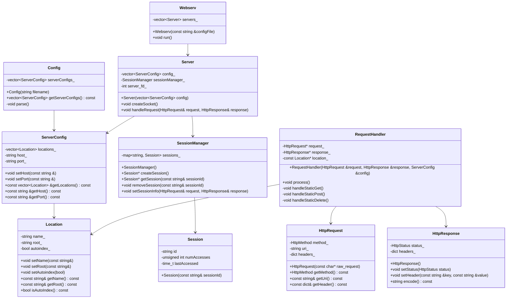
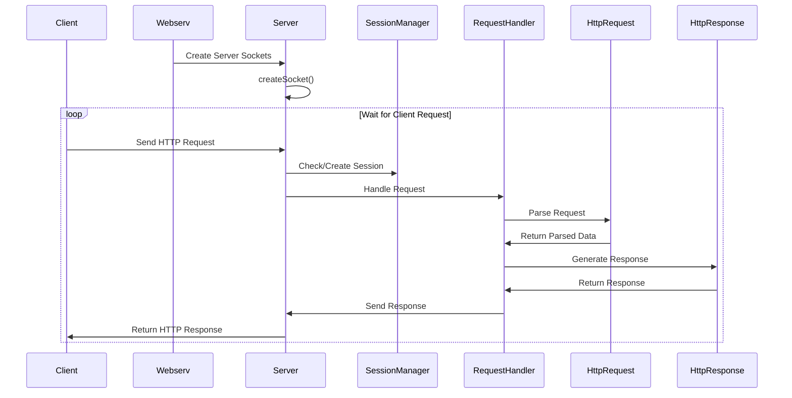

# 🌐 Webserv


A lightweight, high-performance HTTP server implemented in C++98. This project aims to deepen understanding of HTTP protocols, network programming, and server architecture.

## 🚀 Features

- **HTTP/1.1 Compliant**: Implements core features of the HTTP/1.1 protocol
- **Multi-port Listening**: Can listen on multiple ports as specified in the configuration
- **Static File Serving**: Efficiently serves static websites
- **Dynamic Content**: Supports CGI for dynamic content generation
- **File Uploads**: Handles file uploads from clients
- **Custom Error Pages**: Configurable custom error pages
- **Request Methods**: Supports GET, POST, and DELETE methods
- **Non-blocking I/O**: Uses epoll() and kqueue() for efficient I/O operations

## 🛠 Setup

### Prerequisites

- C++ compiler with C++98 support
- Make

### Compilation

Clone the repository and compile the project:

```bash
git clone https://github.com/nktr-cp/webserv.git
cd webserv
make
```

## 🖥 Usage

Run the server with a configuration file:

```bash
./webserv [path_to_config_file]
```

If no configuration file is specified, it will use a default path (`conf/default.conf`).

## 📁 Configuration

The server is configured using a configuration file. Here's a basic example:

```nginx
server {
	listen 8080 ;
	server_name default_server;
	errorpage 301 https://42tokyo.jp;
	
	location / {
		method GET;
		autoindex on;
		index index.html nginx.html;
		root ./;
	}

	location /html/ {
		method GET;
		root /html/;
		autoindex on;
		index index.html;
	}
}
```

Refer to the documentation for more detailed configuration options.

## 🧪 Testing

We recommend testing the server using various methods:

1. Web browsers
2. Command-line tools like `curl`
3. Custom test scripts (e.g., in Python or Go)
4. The provided tester tool

Ensure to test different scenarios, including concurrent connections and edge cases.

## 📚 Resources

- [HTTP/1.1 RFC](https://tools.ietf.org/html/rfc2616)
- [NGINX documentation](https://nginx.org/en/docs/) (for configuration inspiration)

---

## 📊 Architecture

### Class Diagram



### Sequence Diagram
sequenceDiagram


## 👥 Team

This project was developed collaboratively by:

- [Wolframike](https://github.com/Wolframike)
- [oda251](https://github.com/oda251)
- [nktr-cp](https://github.com/nktr-cp)